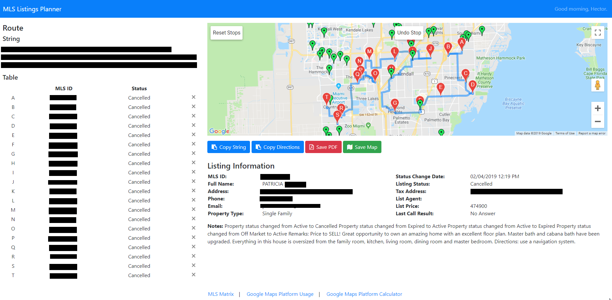

# MLS Listing Planner
A single-page web application that uses the Google Maps JavaScript API, Geocoding API, and Directions API to manage MLS listings from an Excel file and plan visits.

## Libraries
* [jQuery](https://jquery.com/)
* [Underscore.js](https://underscorejs.org/)
* [SheetJS](https://sheetjs.com/)
* [jsPDF](https://parall.ax/products/jspdf)
* [clipboard.js](https://clipboardjs.com/)

## Resources
1. [HTML5 Web Storage](https://www.w3schools.com/html/html5_webstorage.asp)
2. [JavaScript Promise](https://developer.mozilla.org/en-US/docs/Web/JavaScript/Reference/Global_Objects/Promise)
3. [jsPDF-AutoTable Examples](https://github.com/simonbengtsson/jsPDF-AutoTable/blob/master/examples/examples.js)
4. [Google Maps URLs](https://developers.google.com/maps/documentation/urls/guide)
5. [Google Maps Pricing Table](https://cloud.google.com/maps-platform/pricing/sheet/)
6. [Google Maps Geocoding API Query Limit Issue](https://stackoverflow.com/questions/14014074/google-maps-api-over-query-limit-per-second-limit)
7. [Google Maps Geocoding Queue Solution](https://acleach.me.uk/gmaps/v3/plotaddresses.htm)
